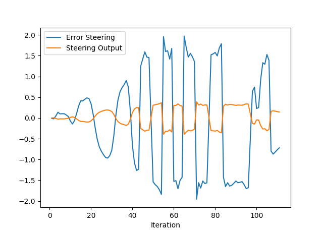
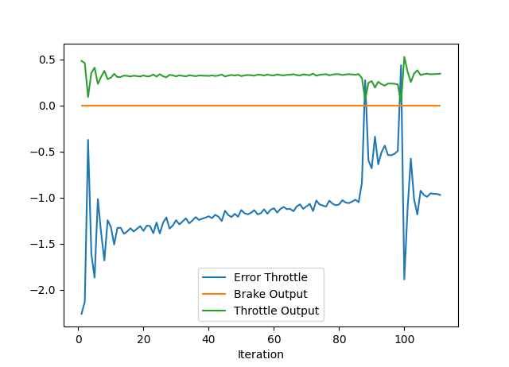

Answer the following questions:
- Add the plots to your report and explain them (describe what you see)

The steering error starts small until the first vehicle is reaced. Then the ego vehicle turns left and then the steering error starts increasing.
The steering output starts smooth. After the first turn, it starts zigzagging between -.5 and .5

The throttle error starts high. Eventually, it starts to decrease.
The throttle output is mostly fixed along the trip.

- What is the effect of the PID according to the plots, how each part of the PID affects the control command?

P stands for proportional. High value makes the ego spin around. The right value makes the ego over shoot the path and not following it.

I stands for integral. This is to reduce the effect mechanical error. large value leads to unstable trajectory. Small value leads to longer time to respond to this kind of error. 

D stands for derivable. looks for the CTE rate. Low value keeps the ego vehicle oscillating. High value leads to longer time to reach the line. The right gain should lead the ego to the line faster.

- How would you design a way to automatically tune the PID parameters?

Manual parameter selection takes a very long time. For this reason, I would use twiddle algorithm. It is basically an iterative process in which adjusting these parameters is done. The process will terminate when a certain tolerance threshold is met.

- PID controller is a model free controller, i.e. it does not use a model of the car. Could you explain the pros and cons of this type of controller?

Pros:

1 - easy to understand and implement.
2 - computationally feasable.
3 - model free pid relies on the underlying physics. 

cons:

1- parameter tuning is hard.
2- long time parameter tuning.
3- for comlex systems, model based becomes more easier to implement.

- (Optional) What would you do to improve the PID controller?

### Tips:

- When you wil be testing your c++ code, restart the Carla simulator to remove the former car from the simulation.
- If the simulation freezes on the desktop mode but is still running on the terminal, close the desktop and restart it.
- When you will be tuning the PID parameters, try between those values:

